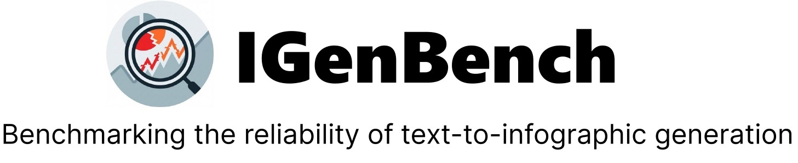
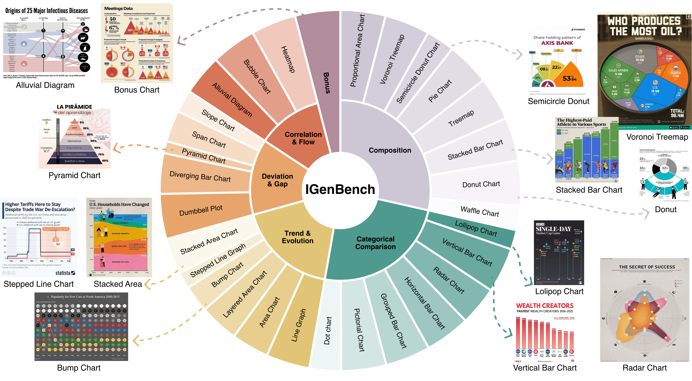
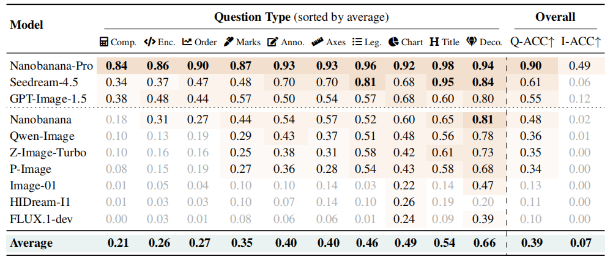

<p align="center">
    <a href="">

     </a>
   <p align="center">

<p align="center">
    <a href="https://arxiv.org/abs/2601.04498"></a>
<a href="https://huggingface.co/datasets/Brookseeworld/IGenBench-Dataset"></a>
    <a href='https://igen-bench.vercel.app/'>
         </a>
</p>



# 🔬 About
**IGenBench** is the first comprehensive benchmark designed to evaluate the reliability of text-to-infographic generation in text-to-image (T2I) models. It comprises 600 curated test cases spanning 30 distinct infographic types, reflecting authentic real-world design needs. The benchmark employs a systematic evaluation framework that decomposes infographic reliability into atomic yes/no verification questions based on a taxonomy of 10 question types, covering both semantic consistency and accurate data encoding. **IGenBench** provides two key metrics: question-level accuracy (Q-ACC) and infographic-level accuracy (I-ACC). Extensive evaluation of state-of-the-art models reveals a significant performance hierarchy and identifies data-related dimensions—such as data completeness and encoding—as universal bottlenecks, highlighting the gap between aesthetic appeal and actual information reliability.

# 🔨Installation
TODO

# 💪 Usage
TODO

# 📊 Leaderboard


# 📝 Citation

If you find IGenBench useful for your research, please cite our paper:

```bibtex
@misc{tang2026igenbenchbenchmarkingreliabilitytexttoinfographic,
      title={IGenBench: Benchmarking the Reliability of Text-to-Infographic Generation}, 
      author={Yinghao Tang and Xueding Liu and Boyuan Zhang and Tingfeng Lan and Yupeng Xie and Jiale Lao and Yiyao Wang and Haoxuan Li and Tingting Gao and Bo Pan and Luoxuan Weng and Xiuqi Huang and Minfeng Zhu and Yingchaojie Feng and Yuyu Luo and Wei Chen},
      year={2026},
      eprint={2601.04498},
      archivePrefix={arXiv},
      primaryClass={cs.LG},
      url={https://arxiv.org/abs/2601.04498}, 
}
```